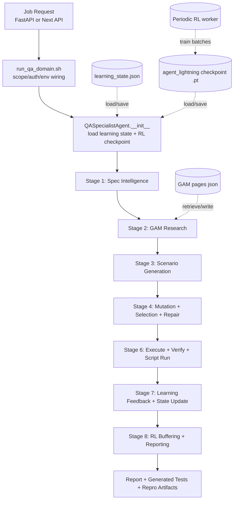

# SpecForge Architecture Flow (In Depth)

This document describes the current end-to-end runtime flow of SpecForge based on the active code paths in `backend/qa_customer_api.py`, `backend/run_qa_domain.sh`, and `backend/spec_test_pilot/qa_specialist_agent.py`.

## 1. Scope and Runtime Paths

SpecForge currently runs through three trigger paths:

1. FastAPI customer backend (split mode):
- `POST /api/jobs` in `backend/qa_customer_api.py`
- worker executes `backend/run_qa_domain.sh`
- shell script launches `backend/qa_agent_runner.py`

2. Direct CLI mode:
- `backend/run_qa_domain.sh` -> `backend/qa_agent_runner.py`

3. Next.js full mode:
- `frontend/customer-ui-next/app/api/jobs/route.js`
- local Node runner (`frontend/customer-ui-next/lib/runner.js`) executes `backend/run_qa_domain.sh`

The core QA pipeline is always `QASpecialistAgent.run()` in `backend/spec_test_pilot/qa_specialist_agent.py`.

## 2. System Goals

Inputs:

1. OpenAPI spec path
2. runtime request contract (domains, auth mode/context, scope controls, thresholds, limits)
3. optional customer prompt/intent

Outputs:

1. executed scenario portfolio with verdicts
2. generated test artifact (`python_pytest` or other script kind)
3. structured report (`qa_execution_report.json` and `qa_execution_report.md`)
4. persistent learning state (`*_learning_state.json`)
5. persistent RL checkpoint (`*.pt`)

## 3. Component Boundaries

1. Orchestrator: `QASpecialistAgent`
- spec intelligence, GAM retrieval, generation, mutation, selection, execution, verification, reporting

2. Scenario generator: `HumanTesterSimulator` (`multi_language_tester.py`)
- LLM-first with heuristic fallback
- produces candidate `TestScenario` portfolio

3. Memory layer: `GAMMemorySystem` (`memory/gam.py`)
- session/memo persistence
- research loop (plan -> retrieve -> reflect)

4. Selection policy: `AdaptiveScenarioPolicy` (`adaptive_policy.py`)
- contextual linear-UCB style scoring with persisted `A`, `b`, and per-fingerprint stats

5. Execution runtime:
- mock mode: dynamic FastAPI app (`dynamic_mock_server.py`) + `TestClient`
- live mode: HTTP adapter with optional preflight and prod-safe method restrictions

6. RL trainer: `AgentLightningTrainer` (`agent_lightning_v2.py`)
- observability traces + replay buffer + checkpoint persistence
- periodic training batches

## 4. End-to-End Flow

## 5. Runtime Stages in `QASpecialistAgent.run()`

The report includes per-stage timing in `metadata.stage_metrics_ms`.

1. `stage_1_spec_intelligence`
- load/parse spec
- infer auth map and operation index
- build dependency/workflow/risk intelligence

2. `stage_2_gam_memory_research`
- start GAM session
- persist learning/spec pages
- run research plan/reflection
- build context pack and diagnostics
- optional MCP tool excerpts if enabled

3. `stage_3_scenario_generation`
- compose effective prompt (user prompt + GAM + RL focus)
- generate base scenarios (LLM or heuristic)
- apply happy-path/workflow/real-life guardrails

4. `stage_4_mutation_selection`
- RL/history mutation expansion
- dedupe and budgeted selection
- repair/normalize scenarios for execution

5. `stage_6_execute_verify`
- execute scenario set
- rerun for flaky detection
- classify failures and build repair suggestions
- generate one script artifact and optionally execute it

6. `stage_7_reward_training`
- build summary
- compute rewards and decision signals
- update learning state and policy movement deltas

7. `stage_8_reporting_rl`
- call Agent Lightning adapter
- attach RL training stats/result
- write JSON + Markdown reports

## 6. RL Behavior: Per-Run vs Periodic

Important current behavior:

1. Per QA run:
- transitions are collected and appended to replay buffer
- checkpoint is autosaved
- RL result is typically `buffered_only` in run-time path

2. Actual gradient training:
- executed by periodic trainer (`run_periodic_training`)
- triggered by FastAPI periodic worker (`QA_RL_PERIODIC_*` env knobs)
- can also be triggered manually via API or `backend/rl_periodic_trainer.py`

This means run-time learning is split into:

1. online data collection
2. offline/periodic optimization batches

## 7. Quality Gates

There are two gate layers:

1. In-report quality gate (`summary.meets_quality_gate`)
- pass-rate floor
- LLM degradation policy
- critical operation/assertion checks

2. Wrapper CI gate (`backend/ci_quality_gate.py`, invoked by `run_qa_domain.sh` when enabled)
- pass-rate floor
- flaky overlap ratio
- run-reward drop and pass-rate drop vs previous run
- GAM context quality floor
- optional safe-mode checkpoint rollback marker

## 8. Persistence and Artifacts

Per domain run output directory contains:

1. `qa_execution_report.json`
2. `qa_execution_report.md`
3. `generated_tests/` (one primary script kind)
4. `llm_scenario_debug.jsonl`
5. copied/scoped spec files used for execution

State persistence locations (typical):

1. checkpoint: `/tmp/qa_ui_checkpoints/*.pt` (FastAPI mode)
2. job reports: `/tmp/qa_ui_runs/*`
3. GAM memory pages: alongside learning state in output/checkpoint folder
4. learning state: checkpoint-adjacent `*_learning_state.json`

## 9. Safety and Isolation Controls

1. Auth handling:
- request payload auth context is redacted in stored job snapshot
- runtime secrets are injected only into child process env

2. Script safety:
- generated Python/cURL validation checks before script execution

3. Path safety:
- generated script fetch endpoints enforce output-dir containment

4. Live-mode guardrails:
- optional connectivity preflight
- `prod_safe` restricts to safe HTTP methods

## 10. Operational Notes

1. FastAPI and Next full mode share payload intent but differ in storage shape:
- FastAPI uses snake_case (`current_domain`, `return_code`)
- Next local mode uses camelCase (`currentDomain`, `exitCode`)

2. UI normalizes both shapes in the frontend page model.

3. Primary production path for this repo remains:
- `qa_customer_api.py` + `run_qa_domain.sh` + `QASpecialistAgent` + `agent_lightning_v2.py`.
